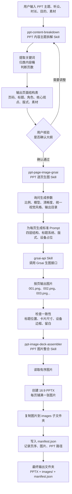
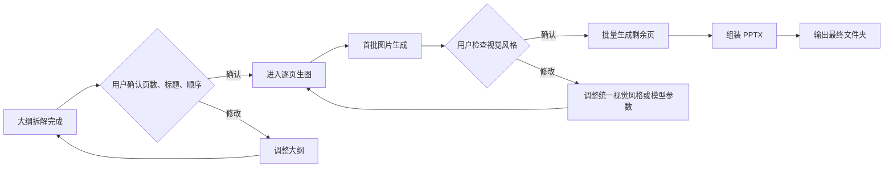

# PPT 工作流 Skills 架构图

这套工作流由三个核心 Skill 组成，目标是把“一个 PPT 主题”稳定转成“可核验的大纲、统一风格逐页图片、最终 PPTX 文件夹”。

## 总体链路



## Skill 分工

| Skill | 位置 | 职责 | 产物 |
| --- | --- | --- | --- |
| `ppt-content-breakdown` | `skills/productivity/ppt-content-breakdown` | 把复杂主题拆成演讲型 PPT 大纲，并要求用户核验 | 页面结构表、每页衔接信息、交给生图 Skill 的单页输入 |
| `ppt-page-image-grsai` | `skills/productivity/ppt-page-image-grsai` | 统一整套 PPT 的视觉语言，逐页生成 Grsai 生图 Prompt，并调用 Grsai | 有序图片、每页 Prompt、生成参数记录 |
| `ppt-image-deck-assembler` | `skills/productivity/ppt-image-deck-assembler` | 把逐页图片按顺序合成为 PPTX，并输出完整文件夹 | `.pptx`、`images/`、`manifest.json` |
| `grsai-api` | `skills/mlops/grsai-api` | 底层 Grsai API 调用能力 | 图片生成请求与结果 |

## 推荐输出目录

```text
outputs/
└── <deck-name>/
    ├── deck_plan.json
    ├── prompts/
    │   ├── 001.md
    │   ├── 002.md
    │   └── 003.md
    ├── generated-images/
    │   ├── 001_<page-title>.png
    │   ├── 002_<page-title>.png
    │   └── 003_<page-title>.png
    └── final/
        ├── <deck-name>.pptx
        ├── manifest.json
        └── images/
            ├── 001_<page-title>.png
            ├── 002_<page-title>.png
            └── 003_<page-title>.png
```

## 运行时依赖

| 项目 | 用途 |
| --- | --- |
| `GRSAI_API_KEY` | 调用 Grsai API 生图 |
| `python-pptx` | 将图片组装为 PPTX |
| `Pillow` | 读取图片尺寸、校验图片文件 |
| 本地 Hermes Skill 系统 | 让三个 Skill 可通过自然语言触发与接力 |

## 用户核验点



## 错误处理建议

| 场景 | 当前处理 | 建议补强 |
| --- | --- | --- |
| 某页生图失败 | 记录失败页，允许重试 | 写入 `generation_log.json`，保留错误、模型、prompt、重试次数 |
| 图片顺序混乱 | 依赖文件名排序 | 强制使用三位页码前缀，例如 `001_标题.png` |
| 用户想调整某一页 | 手动重新生成该页 | 增加“只重生第 N 页”的参数 |
| PPT 文字不稳定 | 建议重要文字后期编辑 | 增加“图片背景 + PPT 文本框”的可编辑模式 |
| 多次生成覆盖旧结果 | 目前依赖用户指定输出目录 | 增加时间戳目录和覆盖确认 |

## 我建议补充的能力

1. **增加 `deck_plan.json` 作为跨 Skill 契约**

   内容拆解 Skill 不只输出表格，也同步写入结构化 JSON。生图和组装都读取这份文件，避免靠人工复制页面信息。

2. **增加 `generation_log.json`**

   每一页记录模型、比例、prompt、输出文件、状态、错误信息。这样失败时可以只补失败页，也方便复盘成本。

3. **增加预览页**

   在组装 PPT 前生成一个 `preview.html` 或 contact sheet，把所有图片缩略图按页码排列。用户可以快速看整套风格是否统一。

4. **增加草稿和终稿两档参数**

   草稿默认用更省的模型和较低分辨率，确认风格后再用高质量模型生成终稿。例如草稿用 `2048x1152`，终稿用 `3840x2160`。

5. **增加可编辑 PPT 模式**

   现在最稳的是“每页图片铺满 PPT”。后续可以提供可编辑模式：图片做背景，标题和关键文字用 PPT 文本框叠加，方便演讲前修改。

6. **增加单一编排入口**

   目前三个 Skill 职责清晰，适合先跑通。后续可以再加一个总控 Skill，比如 `ppt-full-pipeline`，负责串起“拆解、核验、生图、预览、组装”的完整闭环。

## 当前建议

先保持三个 Skill 分开，不急着合成一个大 Skill。原因是每一步都有天然的人类确认点：

```text
拆解后确认讲法
首图后确认视觉
全图后确认是否组装
```

等这条链路实际跑过几套 PPT 后，再把稳定参数沉淀成一个总控 Skill，会更可靠。
